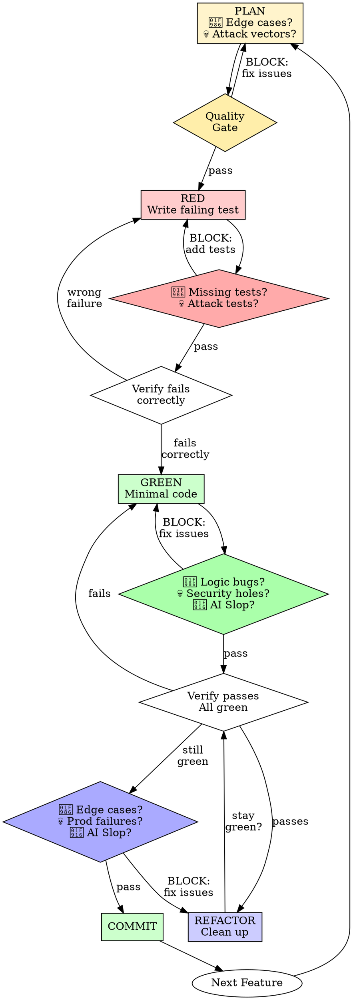

# Test-Driven Development (TDD)

## Overview

Write the test first. Watch it fail. Write minimal code to pass.

**Core principle:** If you didn't watch the test fail, you don't know if it tests the right thing.

**Violating the letter of the rules is violating the spirit of the rules.**

## When to Use

**Always:**
- New features
- Bug fixes
- Refactoring
- Behavior changes

**Exceptions (ask your human partner):**
- Throwaway prototypes
- Generated code
- Configuration files

Thinking "skip TDD just this once"? Stop. That's rationalization.

## The Iron Law

```
NO PRODUCTION CODE WITHOUT A FAILING TEST FIRST
```

Write code before the test? Delete it. Start over.

**No exceptions:**
- Don't keep it as "reference"
- Don't "adapt" it while writing tests
- Don't look at it
- Delete means delete

Implement fresh from tests. Period.

## Red-Green-Refactor with Built-In Quality



**Key Change:** Quality analysis runs AT EACH PHASE BOUNDARY, blocking progression until issues are fixed. Not just at the end.

## Phase 0: PLANNING (Before Writing Tests)

**MANDATORY: Run quality analysis before writing ANY tests.**

### 🦆 Rubber Duck Planning

Explain what the code needs to handle:

**Edge Cases:**
- Null/undefined/empty inputs
- Boundary values (0, -1, MAX_INT, empty string, 10MB string)
- Missing required data
- Invalid types or formats
- Duplicate/conflicting data

**State Issues:**
- Race conditions (concurrent requests)
- Mid-operation failures (network drop during transaction)
- State inconsistencies (status transitions)
- Cleanup on error (partial updates)

**External Dependencies:**
- API timeouts/500s
- Database connection failures
- Redis/cache unavailable
- File system errors (full disk, permissions)

**Output:** List of scenarios to test

### 💀 Be-a-Shithead Planning

How would you exploit this?

**Security Holes:**
- Input sanitization missing → SQL injection, XSS, path traversal
- Auth/authorization checks missing → privilege escalation
- Rate limiting missing → DOS attacks
- Sensitive data logging → credential leaks

**Data Integrity:**
- No transaction wrapper → partial updates on failure
- No unique constraints → duplicates
- No foreign key checks → orphaned records
- Read-modify-write without locking → race conditions

**Performance Killers:**
- N+1 queries in loops
- No pagination → memory exhaustion
- Synchronous I/O → event loop blocking
- No caching → repeated expensive operations

**Output:** List of attack vectors to test

### 🤖 AI Slop Check

Before defining tasks, check for slop in the plan:

**Hard Block (Must Fix):**
- TODOs or "implement later" placeholders
- Generic task names ("handle data", "process stuff")
- Vague acceptance criteria
- Missing error handling strategy
- No mention of edge cases

**Good Planning:**
- Specific, actionable tasks
- Clear success criteria
- Edge cases and error paths identified
- Security considerations noted

### QUALITY GATE: Plan Review

**BLOCKS progression to RED phase until:**
- ✅ All edge cases identified
- ✅ All attack vectors identified  
- ✅ No TODOs or placeholders in plan
- ✅ Clear, specific tasks defined

**Example Block:**
```
🛑 Planning quality gate BLOCKED:

🦆 What happens if database disconnects mid-transaction?
💀 No input sanitization mentioned - SQL injection risk
🤖 Task name "handle user data" is too generic
```

Fix these before writing tests.

## Phase 1: RED - Write Failing Test

Write tests in priority order:
1. **Failure tests first** (null, undefined, invalid inputs)
2. **Error path tests** (timeouts, exceptions, failures)
3. **Attack vector tests** (injection, XSS, auth bypass)
4. **Happy path tests last**

Write one minimal test showing what should happen.

<Good>
```typescript
test('retries failed operations 3 times', async () => {
  let attempts = 0;
  const operation = () => {
    attempts++;
    if (attempts < 3) throw new Error('fail');
    return 'success';
  };

  const result = await retryOperation(operation);

  expect(result).toBe('success');
  expect(attempts).toBe(3);
});
```
Clear name, tests real behavior, one thing
</Good>

<Bad>
```typescript
test('retry works', async () => {
  const mock = jest.fn()
    .mockRejectedValueOnce(new Error())
    .mockRejectedValueOnce(new Error())
    .mockResolvedValueOnce('success');
  await retryOperation(mock);
  expect(mock).toHaveBeenCalledTimes(3);
});
```
Vague name, tests mock not code
</Bad>

**Requirements:**
- One behavior
- Clear name
- Real code (no mocks unless unavoidable)

### Verify RED - Watch It Fail

**MANDATORY. Never skip.**

```bash
npm test path/to/test.test.ts
```

Confirm:
- Test fails (not errors)
- Failure message is expected
- Fails because feature missing (not typos)

**Test passes?** You're testing existing behavior. Fix test.

**Test errors?** Fix error, re-run until it fails correctly.

### QUALITY GATE: Test Coverage

**MANDATORY: After writing tests, before GREEN phase.**

### 🦆 Test Coverage Check

Do my tests cover what I identified in planning?

**Check:**
- ❌ Missing null/undefined test
- ❌ Missing database timeout test
- ❌ Missing concurrent request test
- ✅ Happy path covered

**Output:** List of missing tests

### 💀 Attack Vector Tests

Can I attack this with current tests?

**Check:**
- ❌ No SQL injection test: `userId=1' OR '1'='1`
- ❌ No path traversal test: `filename=../../etc/passwd`
- ❌ No XSS test: `name=<script>alert(1)</script>`
- ❌ No auth bypass test: missing/invalid token
- ✅ Rate limit test exists

**Output:** List of missing security tests

### 🤖 AI Slop in Tests

**Hard Block (Must Fix Before GREEN):**
- Generic test names (`test('it works')`, `test('test1')`)
- Tests that just call mocks without asserting real behavior
- Commented-out tests or `.skip()` without documented reason
- Copy-pasted tests with minor tweaks (extract helper instead)

**BLOCKS GREEN phase until:**
- ✅ All identified edge cases have tests
- ✅ All attack vectors have tests
- ✅ No generic/meaningless test names
- ✅ No AI slop patterns

**Example Block:**
```
🛑 Test coverage quality gate BLOCKED:

🦆 No test for null userId (identified in planning)
💀 No SQL injection test for search parameter
🤖 Test named 'test1' - rename to describe behavior
```

Add missing tests before writing implementation code.

## Phase 2: GREEN - Minimal Code

Write simplest code to pass the test.

<Good>
```typescript
async function retryOperation<T>(fn: () => Promise<T>): Promise<T> {
  for (let i = 0; i < 3; i++) {
    try {
      return await fn();
    } catch (e) {
      if (i === 2) throw e;
    }
  }
  throw new Error('unreachable');
}
```
Just enough to pass
</Good>

<Bad>
```typescript
async function retryOperation<T>(
  fn: () => Promise<T>,
  options?: {
    maxRetries?: number;
    backoff?: 'linear' | 'exponential';
    onRetry?: (attempt: number) => void;
  }
): Promise<T> {
  // YAGNI
}
```
Over-engineered
</Bad>

Don't add features, refactor other code, or "improve" beyond the test.

### QUALITY GATE: Code Review

**MANDATORY: After writing code, before running tests.**

### 🦆 Logic Review

Walk through the code line by line:

**Check for:**
- Assumptions that could fail (null checks missing)
- Missing `await` on promises
- Silent failures (catch without log/rethrow)
- No validation before parsing/transforming
- Off-by-one errors in loops/arrays
- Incorrect error propagation

**Output:** Specific bugs found with line numbers

### 💀 Security Audit

What did you forget?

**Critical Issues:**
- User input in SQL/queries → SQL injection
- No rate limiting on expensive operations → DOS
- Weak hashing (bcrypt rounds < 10) → credential compromise  
- Logging sensitive data (passwords, tokens) → leaks
- No authorization checks → privilege escalation
- File paths from user input → directory traversal
- Eval/exec with user input → RCE

**Output:** Security vulnerabilities with severity

### 🤖 AI Slop in Code

**Hard Block (Must Fix Before Tests Run):**
- TODOs or `// implement this later` comments
- Placeholder implementations (`throw new Error('not implemented')`)
- Generic variable names (`data`, `result`, `temp`, `var1`) without context
- Magic numbers without explanation (`if (status === 3)`)
- Empty catch blocks or generic errors (`catch (e) {}`)
- Dead code / unused imports
- Copy-pasted code blocks (extract function instead)

**Acceptable (Context-Dependent):**
- `result` for return value in small, focused function
- `config` for configuration objects
- `items` in map/filter transformations
- Domain-specific abbreviations in context

**BLOCKS test execution until:**
- ✅ All critical security issues fixed
- ✅ All obvious logic bugs fixed
- ✅ No TODOs or placeholders
- ✅ No AI slop patterns

**Auto-Fix Examples:**
```typescript
// Before (AI Slop)
const data = await fetchUser();
if (data) {
  // process data
}

// After (Auto-Fixed)
const user = await fetchUser();
if (!user) {
  throw new AppError('User not found', 404);
}
// process user
```

**Example Block:**
```
🛑 Code quality gate BLOCKED:

🦆 Line 23: Assumes `user` exists but could be null from query
💀 Line 45: User input `${req.query.search}` in SQL - INJECTION RISK
🤖 Line 67: TODO comment - implement or remove
🤖 Line 89: Generic variable `data` - rename to `subscription`

Auto-fixed:
✅ Added missing await on line 12
✅ Added null check on line 34
```

Fix blocked issues before running tests.

### Verify GREEN - Watch It Pass

**MANDATORY.**

```bash
npm test path/to/test.test.ts
```

Confirm:
- Test passes
- Other tests still pass
- Output pristine (no errors, warnings)

**Test fails?** Fix code, not test.

**Other tests fail?** Fix now.

## Phase 3: REFACTOR - Clean Up

After green only:
- Remove duplication
- Improve names
- Extract helpers

Keep tests green. Don't add behavior.

### QUALITY GATE: Final Review

**MANDATORY: After REFACTOR, before COMMIT.**

### 🦆 Edge Case Validation

Does this handle everything identified in planning?

**Check:**
- Database disconnect during transaction?
- Timeout on external API call (no timeout set = hangs forever)?
- Cleanup if Promise rejects halfway through?
- Disk space check before writing large files?
- Memory limits on large datasets?

**Output:** Missing edge case handling

### 💀 Production Failures

What breaks in production that passed in tests?

**Time Bombs:**
- Memory leaks (event listeners not removed, closures holding references)
- Performance issues (O(n²) algorithm, N+1 queries)
- No retry logic on transient failures
- No monitoring/logging for debugging production issues
- No graceful degradation if dependency unavailable
- Data loss from missing transaction rollback

**Output:** Production risks

### 🤖 AI Slop Final Check

**Hard Block (Must Fix Before COMMIT):**
- Useless comments that restate code:
  ```typescript
  // SLOP: Sets the user
  setUser(user);
  
  // GOOD: Clears session cache to prevent stale auth state
  clearSessionCache();
  ```
- Missing "why" explanations for non-obvious logic
- Inconsistent patterns within same file
- Dead code or unused imports remaining
- Over-abstraction without clear benefit

**BLOCKS commit until:**
- ✅ All identified edge cases handled
- ✅ Production failure risks mitigated
- ✅ No useless comments
- ✅ "Why" explanations for complex logic
- ✅ No dead code or unused imports

**Auto-Fix Examples:**
```typescript
// Auto-fixed: Removed useless comment
- // Sets the user
setUser(user);

// Auto-fixed: Removed unused import
- import { unused } from './module';

// Auto-fixed: Added explanatory comment
+ // Delay retry to avoid thundering herd on upstream service
await sleep(attempt * 1000);
```

**Example Block:**
```
🛑 Final quality gate BLOCKED:

🦆 No timeout on external API call - will hang forever on slow response
💀 Memory leak: Event listener in line 45 never removed
🤖 Comment "// processes data" is useless - remove or explain WHY

Auto-fixed:
✅ Removed 3 unused imports
✅ Removed useless comment on line 23
```

Fix blocked issues, then commit.

## Phase 4: COMMIT

After all quality gates pass:

```bash
git add .
git commit -m "feat: add retry logic with exponential backoff

- Retries failed operations up to 3 times
- Uses exponential backoff to avoid thundering herd
- Handles null user gracefully
- Sanitizes file paths to prevent traversal
- Tests cover injection, null inputs, timeouts"
```bash
git add .
git commit -m "feat: add retry logic with exponential backoff

- Retries failed operations up to 3 times
- Uses exponential backoff to avoid thundering herd
- Handles null user gracefully
- Sanitizes file paths to prevent traversal
- Tests cover injection, null inputs, timeouts"
```

### Repeat

Next failing test for next feature. Start at Phase 0 (PLANNING).

## Good Tests

| Quality | Good | Bad |
|---------|------|-----|
| **Minimal** | One thing. "and" in name? Split it. | `test('validates email and domain and whitespace')` |
| **Clear** | Name describes behavior | `test('test1')` |
| **Shows intent** | Demonstrates desired API | Obscures what code should do |

## Why Order Matters

**"I'll write tests after to verify it works"**

Tests written after code pass immediately. Passing immediately proves nothing:
- Might test wrong thing
- Might test implementation, not behavior
- Might miss edge cases you forgot
- You never saw it catch the bug

Test-first forces you to see the test fail, proving it actually tests something.

**"I already manually tested all the edge cases"**

Manual testing is ad-hoc. You think you tested everything but:
- No record of what you tested
- Can't re-run when code changes
- Easy to forget cases under pressure
- "It worked when I tried it" ≠ comprehensive

Automated tests are systematic. They run the same way every time.

**"Deleting X hours of work is wasteful"**

Sunk cost fallacy. The time is already gone. Your choice now:
- Delete and rewrite with TDD (X more hours, high confidence)
- Keep it and add tests after (30 min, low confidence, likely bugs)

The "waste" is keeping code you can't trust. Working code without real tests is technical debt.

**"TDD is dogmatic, being pragmatic means adapting"**

TDD IS pragmatic:
- Finds bugs before commit (faster than debugging after)
- Prevents regressions (tests catch breaks immediately)
- Documents behavior (tests show how to use code)
- Enables refactoring (change freely, tests catch breaks)

"Pragmatic" shortcuts = debugging in production = slower.

**"Tests after achieve the same goals - it's spirit not ritual"**

No. Tests-after answer "What does this do?" Tests-first answer "What should this do?"

Tests-after are biased by your implementation. You test what you built, not what's required. You verify remembered edge cases, not discovered ones.

Tests-first force edge case discovery before implementing. Tests-after verify you remembered everything (you didn't).

30 minutes of tests after ≠ TDD. You get coverage, lose proof tests work.

## Common Rationalizations

| Excuse | Reality |
|--------|---------|
| "Too simple to test" | Simple code breaks. Test takes 30 seconds. |
| "I'll test after" | Tests passing immediately prove nothing. |
| "Tests after achieve same goals" | Tests-after = "what does this do?" Tests-first = "what should this do?" |
| "Already manually tested" | Ad-hoc ≠ systematic. No record, can't re-run. |
| "Deleting X hours is wasteful" | Sunk cost fallacy. Keeping unverified code is technical debt. |
| "Keep as reference, write tests first" | You'll adapt it. That's testing after. Delete means delete. |
| "Need to explore first" | Fine. Throw away exploration, start with TDD. |
| "Test hard = design unclear" | Listen to test. Hard to test = hard to use. |
| "TDD will slow me down" | TDD faster than debugging. Pragmatic = test-first. |
| "Manual test faster" | Manual doesn't prove edge cases. You'll re-test every change. |
| "Existing code has no tests" | You're improving it. Add tests for existing code. |

## Red Flags - STOP and Start Over

- Code before test
- Test after implementation
- Test passes immediately
- Can't explain why test failed
- Tests added "later"
- Rationalizing "just this once"
- "I already manually tested it"
- "Tests after achieve the same purpose"
- "It's about spirit not ritual"
- "Keep as reference" or "adapt existing code"
- "Already spent X hours, deleting is wasteful"
- "TDD is dogmatic, I'm being pragmatic"
- "This is different because..."

**All of these mean: Delete code. Start over with TDD.**

## Example: Bug Fix

**Bug:** Empty email accepted

**RED**
```typescript
test('rejects empty email', async () => {
  const result = await submitForm({ email: '' });
  expect(result.error).toBe('Email required');
});
```

**Verify RED**
```bash
$ npm test
FAIL: expected 'Email required', got undefined
```

**GREEN**
```typescript
function submitForm(data: FormData) {
  if (!data.email?.trim()) {
    return { error: 'Email required' };
  }
  // ...
}
```

**Verify GREEN**
```bash
$ npm test
PASS
```

**REFACTOR**
Extract validation for multiple fields if needed.

## Verification Checklist

Before marking work complete:

- [ ] Every new function/method has a test
- [ ] Watched each test fail before implementing
- [ ] Each test failed for expected reason (feature missing, not typo)
- [ ] Wrote minimal code to pass each test
- [ ] All tests pass
- [ ] Output pristine (no errors, warnings)
- [ ] Tests use real code (mocks only if unavoidable)
- [ ] Edge cases and errors covered

Can't check all boxes? You skipped TDD. Start over.

## When Stuck

| Problem | Solution |
|---------|----------|
| Don't know how to test | Write wished-for API. Write assertion first. Ask your human partner. |
| Test too complicated | Design too complicated. Simplify interface. |
| Must mock everything | Code too coupled. Use dependency injection. |
| Test setup huge | Extract helpers. Still complex? Simplify design. |

## Debugging Integration

Bug found? Write failing test reproducing it. Follow TDD cycle. Test proves fix and prevents regression.

Never fix bugs without a test.

## Testing Anti-Patterns

When adding mocks or test utilities, read @testing-anti-patterns.md to avoid common pitfalls:
- Testing mock behavior instead of real behavior
- Adding test-only methods to production classes
- Mocking without understanding dependencies

## Final Rule

```
Production code → test exists and failed first
Otherwise → not TDD
```

No exceptions without your human partner's permission.
